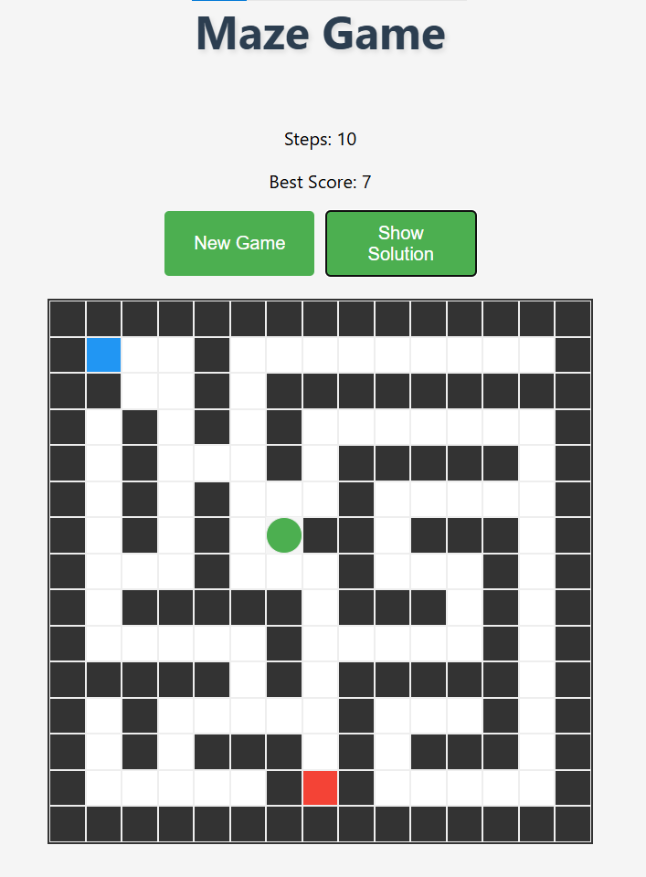

# React Maze Game 🎮

A fun, interactive maze game built with React where players navigate through randomly generated mazes to find the exit. Features pathfinding visualization and score tracking. 

## 🎯 Features

- Randomly generated mazes with guaranteed solutions
- Random exit placement for varied gameplay
- Keyboard arrow controls
- Step counter and best score tracking
- Solution path visualization
- Clean, responsive design 

## 🚀 Demo

### [Demo link](https://aroxing.github.io/react-maze-game)

